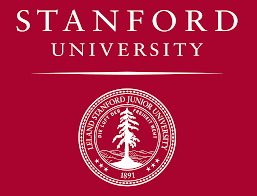

# Machine Learning - Stanford University Courses

## Author
[Andrew Ng (Teacher)](https://www.linkedin.com/in/andrewyng/)

[Thierry Khamphousone](https://www.linkedin.com/in/tkhamphousone/)

## Introduction

Machine learning is the science of getting computers to act without being explicitly programmed.

This course provides a broad introduction to machine learning, datamining, and statistical pattern recognition.

    

 

## General Topics
 

__Supervised learning__

- parametric/non-parametric algorithms
- support vector machines
- kernels
- neural networks

__Unsupervised learning__ 
- clustering
- dimensionality reduction
- recommender systems
- deep learning

__Best practices in machine learning__
- bias/variance theory
- innovation process in machine learning and AI). 
- learning algorithms to building smart robots (perception, control)
- text understanding (web search, anti-spam)
- computer vision
- medical informatics
- audio
- database mining
- other areas

---
 

## History (content and due dates)
 

__Week 1 | Linear Regression with one variable (28/09/2020)__
- Model Representation
- Cost Function
- Gradient Descent
- Linear Algebra Review

 
  
__Week 2 | Linear Regression with Multiple Variables (23/12/2020)__
- Gradient Descent For Multiple Variables
- Features and Polynomial Regression
- Normal Equation
- Normal Equation Noninvertibility
- Octave/Matlab Tutorial
- [machine-learning-ex1](https://github.com/Yulypso/ML-Stanford-University/tree/master/machine-learning-ex1/ex1)

 

__Week 3 | Logistic Regression & Regularization (27/12/2020)__
- Classification
- Hypothesis Representation
- Decision Boundary
- Simplified Cost Function and Gradient Descent
- Advanced Optimization
- Multiclass Classification: One-vs-all
- Problem of Overfitting
- Regularized Linear Regression
- Regularized Logistic Regression
- [machine-learning-ex2](https://github.com/Yulypso/ML-Stanford-University/tree/master/machine-learning-ex2/ex2)

 

__Week 4 | Neural Networks Representation (31/12/2020)__
- Non-linear Hypotheses
- Neurons and the Brain
- Model Representation
- Multiclass Classification
- Neural Networks
- [machine-learning-ex3](https://github.com/Yulypso/ML-Stanford-University/tree/master/machine-learning-ex3/ex3)

 

__Week 5 | Neural Networks Learning (01/01/2021)__
- Backpropagation Algorithm
- Unrolling Parameters
- Gradient Checking
- Random Initialization
- Putting It Together
- Autonomous Driving
- [machine-learning-ex4](https://github.com/Yulypso/ML-Stanford-University/tree/master/machine-learning-ex4/ex4)

 

__Week 6 | Machine Learning System Advice & Design (02/01/2021)__
- Deciding What to Try Next
- Evaluating a Hypothesis
- Model Selection and Train/Validation/Test Sets
- Diagnosing Bias vs. Variance
- Regularization and Bias/Variance
- Learning Curves
- Deciding What to Do Next Revisited
- [machine-learning-ex5](https://github.com/Yulypso/ML-Stanford-University/tree/master/machine-learning-ex5/ex5)
- Prioritizing What to Work On
- Error Analysis
- Error Metrics for Skewed Classes
- Trading Off Precision and Recall
- Data For Machine Learning

 

__Week 7 | Support Vector Machines (04/01/2021)__
- Optimization Objective
- Large Margin Intuition
- Mathematics Behind Large Margin Classification
- Kernels
- Using An SVM
- [machine-learning-ex6](https://github.com/Yulypso/ML-Stanford-University/tree/master/machine-learning-ex6/ex6)

 

__Week 8 | Unsupervised Learning & Dimensionality Reduction (08/01/2021)__
- K-Means Algorithm
- Optimization Objective
- Random Initialization
- Choosing the Number of Clusters
- Data Compression
- Visualization
- Principal Component Analysis Algorithm
- Reconstruction from Compressed Representation
- Choosing the Number of Principal Components
- K-Means Clustering and PCA 
- [machine-learning-ex7](https://github.com/Yulypso/ML-Stanford-University/tree/master/machine-learning-ex7/ex7)

 

__Week 9 | Anomaly Detection & Recommender Systems ()__
- Gaussian Distribution
- Anomaly Detection System
- Anomaly Detection vs Supervised Learning
- Multivariate Gaussian Distribution
- Content Based Recommendations
- Collaborative Filtering Algorithm
- Low Rank Matrix Factorization
- Mean Normalization
- [machine-learning-ex8](https://github.com/Yulypso/ML-Stanford-University/tree/master/machine-learning-ex8/ex8)

 

__Week 10 | Large Scale Machine Learning ()__
- Learning With Large Datasets
- Stochastic Gradient Descent
- Mini-Batch Gradient Descent
- Stochastic Gradient Descent Convergence
- Online Learning
- Map Reduce and Data Parallelism

 

__Week 11 | Photo OCR Application ()__
- Problem Description and Pipeline
- Sliding Windows
- Getting Lots of Data and Artificial Data
- Ceiling Analysis

